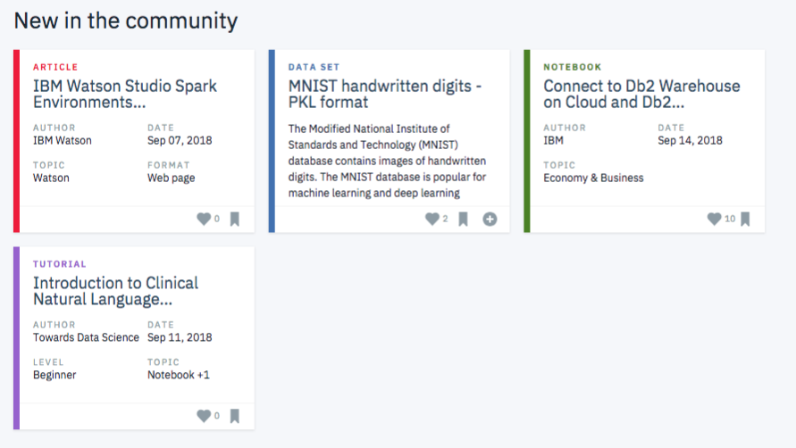

<div id="top"></div>

<!-- PROJECT LOGO -->
<br />
<div align="center">
  

  <h3 align="center">Making recommendations to users of the IBM Watson Studio</h3>

</div>

<!-- TABLE OF CONTENTS -->
<details>
  <summary>Table of Contents</summary>
  <ol>
    <li>
      <a href="#about-the-project">About The Project</a>
      <ul>
        <li><a href="#premise">Premise</a></li>
        <li><a href="#data">Data</a></li>
        <li><a href="#challenges-and-improvements">Challenges and improvements</a></li>
      </ul>
    </li>
    <li>
      <a href="#getting-started">Getting Started</a>
      <ul>
        <li><a href="#setting-up-a-conda-environment">Setting up a conda environment</a></li>
        <li><a href="#file-descriptions">File descriptions</a></li>
        <li><a href="#usage">Usage</a></li>
      </ul>
    </li>
    <li><a href="#additional-notes">Additional Notes</a></li>
    <li><a href="#license">License</a></li>
    <li><a href="#contact">Contact</a></li>
    <li><a href="#acknowledgments">Acknowledgments</a></li>
  </ol>
</details>

---
## About The Project

In this mini-project, I explored different strategies to give users recommendations of various articles available in the IBM Watson Studio platform.

### Premise

In the IBM Watson Studio, there is a large collaborative community ecosystem of articles, datasets, notebooks, and other A.I. and ML. assets. Users of the system interact with all of this. Within this scope, we created this recommendation system project to enhance the user experience and connect them with assets. This personalizes the experience for each user.

<p align="right">(<a href="#top">back to top</a>)</p>

### Data

This project handles data provided by IBM, related to its IBM Watson Platform. More concretely, two datasets are employed:

- **User-item Interactions**: Contains article_id, title and email. These are the articles that have been accessed or viewed by users.
- **Articles content**: Contains the contents of a subset of the articles in the _User-item Interactions_ dataset.

<p align="right">(<a href="#top">back to top</a>)</p>

### Challenges and improvements

This project only covers fundamental recommendation strategies: rank-based, user-user collaborative filtering, content-based collaborative filtering and matrix factorization. All of these strategies are explored on a surface level. I was able to discover the caveats of each method, as well as consider different improvements.

For example, different similarity metrics can be used to determine users close to each other. While I kept things simple and used the dot product, many other options such as simple feature embeddings or interactions predictions thanks to geometric deep learning are possible.

Content-based collaborative filtering was developed using fundamental natural language processing (NLP) techniques. Potential improvements could include more advanced methods based on machine (deep) learning to make the actual predictions. Somewhat in the middle, well-known models such as `doc2vec` are easily available to generate feature embeddings for any corpus.

<p align="right">(<a href="#top">back to top</a>)</p>

---

## Getting Started

To make use of this project, I recommend managing the required dependencies with Anaconda.

### Setting up a conda environment

Install miniconda:

```bash
wget https://repo.anaconda.com/miniconda/Miniconda3-latest-Linux-x86_64.sh
bash Miniconda3-latest-Linux-x86_64.sh
```

Install mamba:

```bash
conda install -n base -c conda-forge mamba
```

Install environment using provided file:

```bash
mamba env create -f environment.yml # alternatively use environment_hist.yml if base system is not debian
mamba activate ibm_recommender
```

### Usage

Simply follow along the main notebook. Use either:

- The Jupyter Notebook: `notebooks/Recommendations_with_IBM.ipynb`.
- Or its HTML version: `notebooks/Recommendations_with_IBM.html`.

### File descriptions

The project files are structured as follows:

- `data`: Where all data is located.
- `data/tests`: Supplementary data needed for tests.
- `notebooks/Recommendations_with_IBM.ipynb`: Main project notebook.
- `src/tests`: Tests functions.

<p align="right">(<a href="#top">back to top</a>)</p>

---

## Additional Notes

Source files formatted using the following commands:

```bash
isort .
autoflake -r --in-place --remove-unused-variable --remove-all-unused-imports --ignore-init-module-imports .
black .
```

## License

Distributed under the MIT License. See `LICENSE` for more information.

## Contact

[Carlos Uziel Pérez Malla](https://www.carlosuziel-pm.dev/)

[GitHub](https://github.com/CarlosUziel) - [Google Scholar](https://scholar.google.es/citations?user=tEz_OeIAAAAJ&hl=es&oi=ao) - [LinkedIn](https://at.linkedin.com/in/carlos-uziel-p%C3%A9rez-malla-323aa5124) - [Twitter](https://twitter.com/perez_malla)

## Acknowledgments

This project was done as part of the [Data Science Nanodegree Program at Udacity](https://www.udacity.com/course/data-scientist-nanodegree--nd025).

<p align="right">(<a href="#top">back to top</a>)</p>
